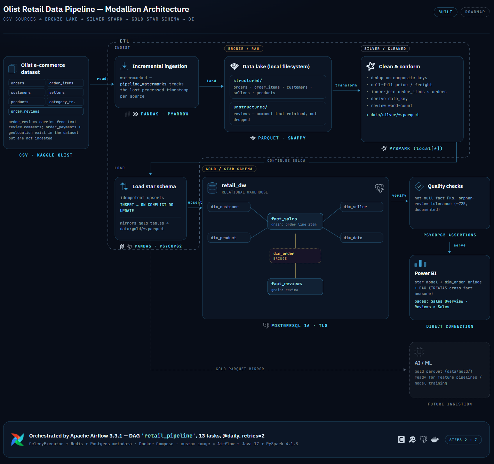
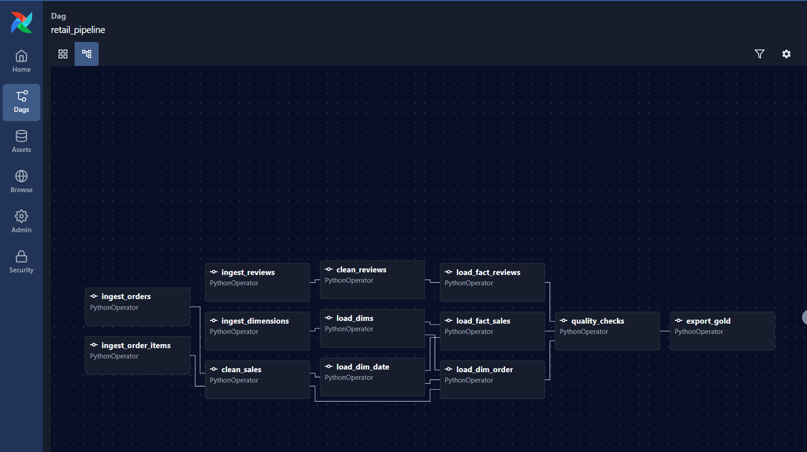
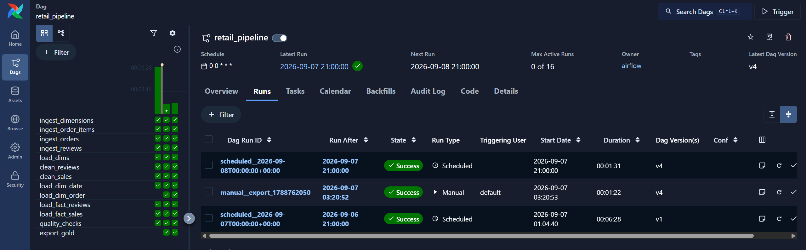
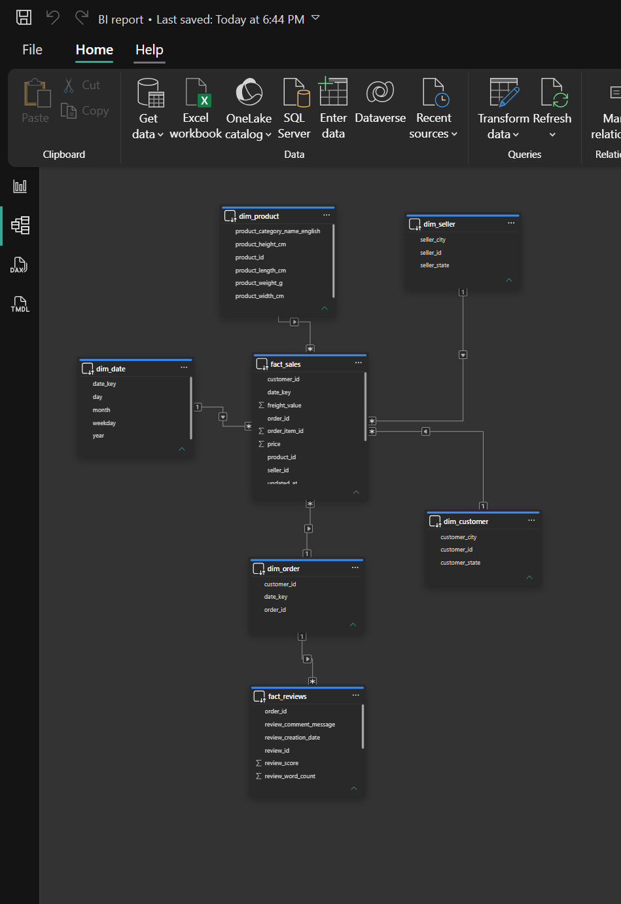

# Retail Data Pipeline — Olist E-Commerce

<p align="center">
  
</p>

An end-to-end batch pipeline that turns the raw [Olist Brazilian e-commerce dataset](https://www.kaggle.com/datasets/olistbr/brazilian-ecommerce)
(~100k orders, 2016–2018) into a query-ready PostgreSQL star schema and a Power BI report.
Ingestion is incremental, transforms run on Spark, and the whole thing is orchestrated as a
single Airflow DAG in Docker.


---

## What it does

- **Extract** — `pandas` reads the Olist CSVs incrementally. A `pipeline_watermarks` table in
  Postgres records the last processed timestamp per source, so re-runs only pick up new rows.
- **Bronze → Silver** — raw data lands as Parquet; `PySpark` deduplicates on composite keys,
  fills nulls, joins line items to orders, and derives fields (`date_key`, review word count).
- **Gold** — cleaned data is upserted (`INSERT … ON CONFLICT DO UPDATE`) into a PostgreSQL
  star schema, and mirrored to `data/gold/*.parquet`.
- **Quality gate** — assertions on the gold tables (no null fact keys, orphan-review count
  within a documented tolerance) run before the data is considered fresh.
- **Serve** — Power BI connects directly to the warehouse.

## Stack

| Layer | Tool |
|---|---|
| Orchestration | Apache Airflow 3.3.1 — CeleryExecutor, Redis broker, Postgres metadata DB |
| Ingestion | pandas, PyArrow |
| Transformation | PySpark (`local[*]`) |
| Warehouse | PostgreSQL 16 (TLS) |
| Loading | psycopg2 idempotent upserts |
| BI | Power BI |
| Packaging | Docker Compose; custom Airflow image = Airflow + Java 17 + PySpark 4.1.3 |
| CI | GitHub Actions — unit tests on every push |

## Pipeline

The `retail_pipeline` DAG runs daily — **13 tasks**, ~1.5 min on a warm run, `retries=2`.

<p align="center"></p>

```
ingest_orders, ingest_order_items  ─►  clean_sales   (PySpark)
ingest_reviews                     ─►  clean_reviews (PySpark)
ingest_dimensions                  ─►  load_dims

clean_sales                        ─►  load_dim_date
clean_sales, load_dims, load_dim_date               ─►  load_dim_order
load_dims, load_dim_date                            ─►  load_fact_sales
clean_reviews                                       ─►  load_fact_reviews

load_fact_sales, load_fact_reviews, load_dim_order  ─►  quality_checks  ─►  export_gold
```

<p align="center"></p>

## Data model

Warehouse `retail_dw`. A star schema with one wrinkle: `fact_sales` is at **order-line-item**
grain and `fact_reviews` is at **review** grain, so they can't join directly without a
many-to-many. A `dim_order` **bridge** lets both facts relate many-to-one to a shared order key.

| Table | Grain | Rows |
|---|---|---|
| `fact_sales` | order line item | 112,650 |
| `fact_reviews` | review | 98,410 |
| `dim_order` *(bridge)* | order | 98,666 |
| `dim_customer` / `dim_product` / `dim_seller` / `dim_date` | reference | 99,441 / 32,951 / 3,095 / 616 |

<p align="center"></p>

## Dashboards

Two Power BI pages on the warehouse (star model + `dim_order` bridge + a `TREATAS` measure to
cross the two fact grains). Report: [`BI/BI report.pbix`](BI/BI%20report.pbix) ·
[PDF](BI/BI%20report.pdf).

| Sales Overview | Reviews × Sales |
|:--:|:--:|
|  |  |

## Run it

Requires Docker and the Olist CSVs placed in `data/raw/olist/`.

```bash
cp .env.example .env
cp .env.airflow.example .env.airflow          # then set a real FERNET_KEY (command is in the file)

docker compose --env-file .env.airflow build  # builds the custom Airflow image (~3 min, once)
docker compose --env-file .env.airflow up -d
```

- **Airflow UI** — http://localhost:8080 (`airflow` / `airflow`). Unpause **`retail_pipeline`** and trigger it.
- **Warehouse** — `localhost:55432`, database `retail_dw`, user `retail_user`.
- `sql/ddl/schema.sql` is applied automatically on first start.

Run a single step outside Airflow (needs a local venv + JDK 17):

```bash
python -m src.ingestion.ingest_orders
python -m src.transforms.clean_sales
python -m src.transforms.load_gold
```

## Tests

```bash
pytest tests/test_transforms.py -v     # Spark transform unit tests — runs in CI
pytest tests/test_data_quality.py -v   # data reconciliation — needs a populated data/ dir
```

## Layout

```
dags/retail_pipeline_dag.py     Airflow DAG (13 tasks)
src/
  ingestion/                    watermarked CSV → bronze parquet (pandas)
  watermark/                    per-source high-water-mark helpers
  transforms/                   spark_utils, clean_sales, clean_reviews, load_gold
  quality_checks/               gold-layer assertions
sql/ddl/schema.sql              warehouse DDL (star schema + dim_order)
docker-compose.yaml             Airflow stack + retail_dw warehouse
Dockerfile                      custom Airflow image (Java 17 + PySpark)
BI/                             Power BI report (.pbix, .pdf)
tests/                          pytest suites
.github/workflows/ci.yml        GitHub Actions
```

## Notes

- **Incremental by design** — each source has its own watermark column
  (`order_purchase_timestamp`, `shipping_limit_date`, `review_creation_date`); re-running the
  DAG is a no-op when nothing is new.
- **Idempotent loads** — every gold write is an upsert on the primary key, so retries and
  backfills never duplicate rows.
- **Two PySpark versions on purpose** — the container runs Python 3.13 → PySpark 4.1.3; the
  local `requirements.txt` pins 3.5.1 for a Python ≤3.12 venv.
- `data/`, `logs/`, `.env*` and `certs/` are git-ignored.
